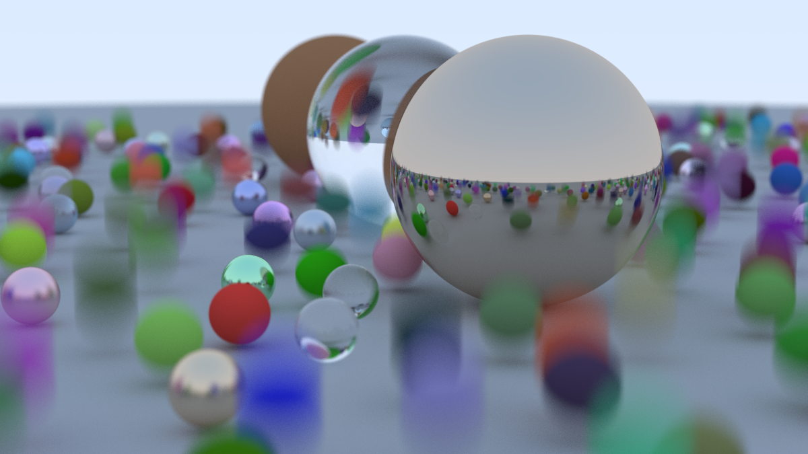
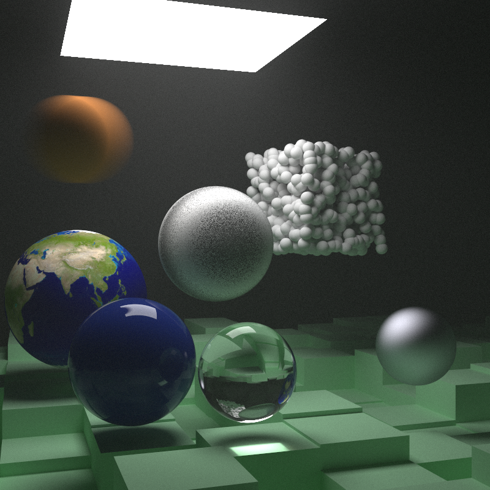

This is my C# implementation of Peter Shirley's [_Ray Tracing in One Weekend_](https://raytracing.github.io/books/RayTracingInOneWeekend.html) and [_Ray Tracing: The Next Week_](https://raytracing.github.io/books/RayTracingTheNextWeek.html)

Some notable changes:
- Code split in two projects:
  - `RTLib` containing the renderer, materials, textures, _hittables_ and other supporting code
  - `RTConsole` containing the console runner and scene definitions
- Support for PNG output using [ImageSharp](https://github.com/SixLabors/ImageSharp)
- Support for single-faced rectangles. For example they can be used to "close" a Cornell Box while still being able to see inside.
- Implemented two renderers:
  - `ParallelRenderer` works very similarly to the original from the book, with the main change being that it uses `Parallel.For` to allow rendering lines in parallel.
  - `IncrementalRenderer` uses a slightly tweaked loop to render one sample for every pixel at a time, and saving the image every 10 samples. This allows you to see results very quickly, and spot any obvious problem without having to wait for a full render.
  
Other changes include some performance tweaks, and using more idiomatic C# coding structures.
I wouldn't consider this code to be highly optimized, but I've done my best to remove the main bottlenecks.

You can render images using this command line:
```
cd RTConsole
dotnet run -c Release -- [output_file_name].png [scene_number_from_1_to_8]

# For example
dotnet run -c Release -- image.png 1
```

If you have [Just](https://github.com/casey/just), you can also use `just render SCENE_NUMBER` to do the same.

Available scenes:
1. The _random scene_ from the end of book 1
2. Two spheres with a checkered texture
3. Two speres with a noise "marble-like" texture
4. A sphere with the earth texture
5. A scene with a sphere and a couple light sources
6. Cornell Box, with glass and metal boxes
7. Cornell Box, with "smoky" materials for the boxes
8. The final scene from book 2

## Sample Renders

### Random Scene


### Final Scene

